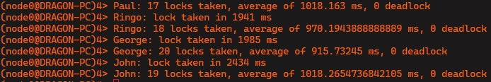

# Informe de practica: Muty (Sistemas Distribuidos)

## Intento de resolución de safety y liveness

## Lock2

El modulo lock1 asegura que solo un worker pueda acceder a la seccion critica a la vez, sin embargo la implementacion no asegura que todos los workers accedan al lock antes del timeout, haciendo que el worker intentando se "rinda" y reinicie su ejecucion.

### Funcionamiento

Para intentar solucionar este problema, se implemento un modulo lock2, el cual extiende la logica de lock1 agregando un sistema de prioridades. Cada worker utiliza su id como prioridad, y el worker con la prioridad mas alta es el primero en acceder al lock. Cuando un lock en espera recibe un request de otro lock con mayor prioridad, este le da el "ok" inmediatamente en lugar de retenerlo hasta recibir un mensaje de release.

### Problemas

El sistema de prioridad de lock2 no resuelve completamente la regla de fairness ya los workers con locks mas prioritarios pueden generar starvation en los workers con locks menos prioritarios dependiendo el tiempo que se demore cada worker en salir de la seccion critica. Con tiempos de trabajo menores se observa tambien que el worker mas prioritario toma la mayoria de los lock comparado al resto de los workers.

---

###### Worker "John" con prioridad 1 tomando la mayoria de los locks. La ejecucion es de 30 segundos, con los parametros de "sleep" y "work" configurados en 100 y 500 respectivamente.

###### Ejecucion similar a la anterior, pero con los parametros "sleep" y "work" configurados en 1000 para ambos. El worker "John" sigue tomando la mayoria de los locks.

---

## Intento de resolución de safety, liveness y fairness

## Lock3

Para soluciónar el problema de fairness presente en el lock anterior, se mejora la logica de prioridad agregando tiempos logicos Lamport.

### Funcionamiento

Con lock3, cada lock tiene un reloj logico Lamport. El reloj es incrementado cada vez que un worker notifica a su lock que quiere acceso a la seccion critica.
La logica de prioridad consiste en comparar los relojes de dos locks intentando acceder a la seccion critica, quien tenga el tiempo menor entre ambos es quien tiene mas prioridad para el acceso. Si el tiempo de ambos resultase similar.

### Problemas

No se encontro ninguna anomalia respecto a safety, liveness o deadlock con la implementacion de lock3.

---

###### Ejecucion de 30 segundos con los parametros "sleep" y "work" configurados en 1000 para ambos. Se observa que los workers toman locks de forma mas equitativa que en lock2 y que no hay starvation.

