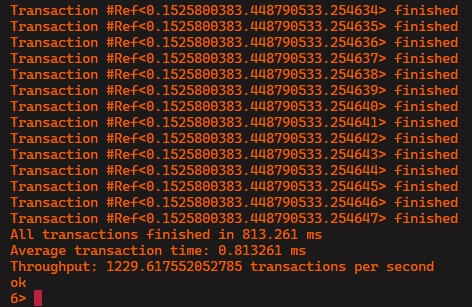
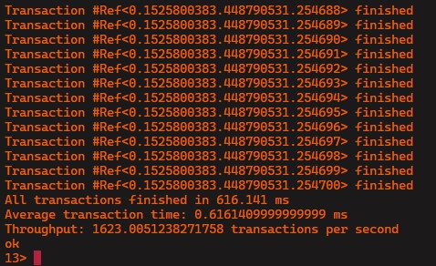

# Informe de practica: Opty (Sistemas Distribuidos)

## Analisis de performance

El benchmark del sistema consiste en realizar de manera concurrente N transacciones, las cuales consisten en una operacion (lectura o escritura), y su correspondiente "commit". Para esto, por cada transacción se genera un handler. El benchmark espera a que todos los handlers completen sus transacciones para calcular el tiempo total de ejecución. 

Cada transaccion tiene una referencia unica, las cuales son utilizadas por la herramienta de benchmark para calcular el tiempo demorado para completar todas las transacciones. A partir dicha demora se estima las posibles transacciones por segundo, y el promedio de tiempo por transaccion.

## Benchmark de escritura

En esta prueba, se escriben 1000 entradas diferentes en la Store.

Se obtiene que el tiempo promedio por transaccion es de aproximadamente 0.81 ms, lo que resulta en un promedio de ~1230 transacciones de escritura por segundo.

## Benchmark de lectura

En esta prueba, se leen 1000 entradas diferentes de la Store.

Se obtiene que el tiempo promedio por transaccion es de aproximadamente 0.61 ms, lo que resulta en un promedio de ~1623 transacciones de lectura por segundo.

## Conclusiones

Con estos resultado, se puede concluir que las operaciones de lectura son mas rapidas que las de escritura.

**pendiente: desarrollar preguntas planteadas en el readme del tp!**
