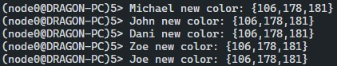
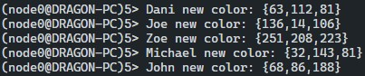

# Informe de practica: Toty (Sistemas Distribuidos)

## Arquitectura general

El sistema Toty esta compuesto con los siguientes modulos:

- **Multicast Basico**: Este modulo envia mensajes a todos los nodos pares de un grupo, pero a menos que su jitter sea nulo, no garantiza que todos los nodos reciban el mensaje en un mismo orden.
- **Multicast de ordenamiento total**: Este modulo es similar al anterior, pero que garantiza que todos los nodos reciban los mensajes en el mismo orden sin importar el valor de jitter.
- **Manager de grupo**: Este modulo es el encargado de mantener la lista de nodos que conforman el grupo, y de notificar a los nodos cuando se agrega o remueve un nodo del grupo. Siendo que la logica de multicast y worker esta separada, un grupo es conformado por nodos de multicast en lugar de nodos de worker.
- **Worker**: Este modulo se encarga de enviar y recibir mensajes a su grupo a travez de un modulo de multicast provisto por el manager de grupo. Al recibir un mensaje, el worker lo muestra por pantalla a travez de un modulo de interfaz de usuario.
- **Interfaz de usuario**: Este modulo es el encargado de mostrar los mensajes recibidos por el worker en pantalla.

El modulo "toty" es el encargado de correr las pruebas del sistema con alguno de los dos multicast mencionados.

## Multicast Basico

### Ejecucion y resultados

Al ejecutar el sistema con cinco workers, multicast basico y jitter nulo, se observa que los mensajes conservan el mismo orden en todos los workers. Sin embargo, este efecto se da solo por unos instantes, ya que pasado algunos segundos se observa que los mensajes pierden el orden. 
Por otro lado, si se ejecuta el sistema con un jitter de 100ms, se observa que los mensajes pierden el orden desde el principio.

---

##### Multicast basico sin jitter, orden inicial.
---

##### Multicast basico sin jitter, orden de mensajes luego de 30 segundos aproximadamente. Resultado similar a cuando se ejecuta con jitter.
---

## Multicast de ordenamiento total

### Ejecucion y resultados

Al ejecutar el sistema con cinco workers, multicast de ordenamiento total y un jitter que o bien puede o no ser nulo, se observa que los mensajes conservan el mismo orden en todos los workers. Esto se debe a que el modulo de multicast de ordenamiento total utiliza una logica de consenso para garantizar que todos los nodos reciban los mensajes en el mismo orden sin importar el valor de jitter.

<!-- ## Conclusiones -->

<!-- pendiente -->